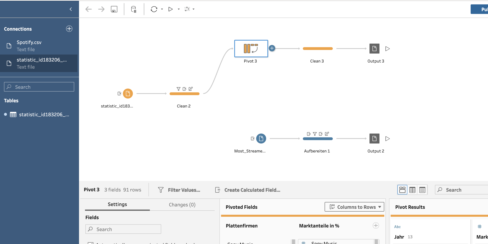
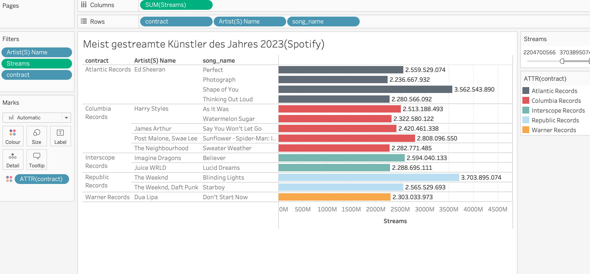
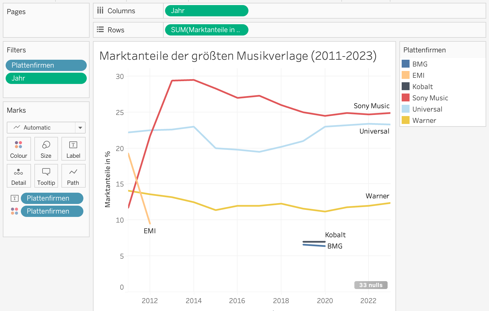

# Dashboard-zur-Visualisierung-der-meist-gestreamte-Songs-2023-auf-Spotify
   

Dieses Dashboard visualisiert die Marktanteile der großen Musiklabels sowie die meistgestreamten Künstler auf Spotify im Jahr 2023. Es zeigt den Zusammenhang zwischen Marktdominanz und Künstlerpopularität in der Musikindustrie.

## Verwendete Technologie
* Tableau

## Datenaufbereitung

## Visualisierung
### Meist gestreamte Künstler des Jahres 2023 auf Spotify

### Marktanteile der drei großen Plattenfirmen

## Visualisierte Daten
* Marktanteile von Sony Music, Universal Music und Warner Music
* Meistgestreamte Künstler auf Spotify im Jahr 2023

## Ziel der Analyse
Das Dashboard stellt den Zusammenhang zwischen der Marktdominanz der großen Musiklabels und der Popularität ihrer Künstler auf Streaming-Plattformen dar.

## Datenquellen
* Marktanteilsdaten der Musiklabels (https://de.statista.com/statistik/daten/studie/183206/umfrage/marktanteile-der-groessten-musikverlage-weltweit/)
* Spotify Streaming-Daten 2023 (https://www.kaggle.com/datasets/nelgiriyewithana/top-spotify-songs-2023/data)

## Icons
* Link: (https://www.flaticon.com/free-icon/spotify_121148?related_id=121148)
